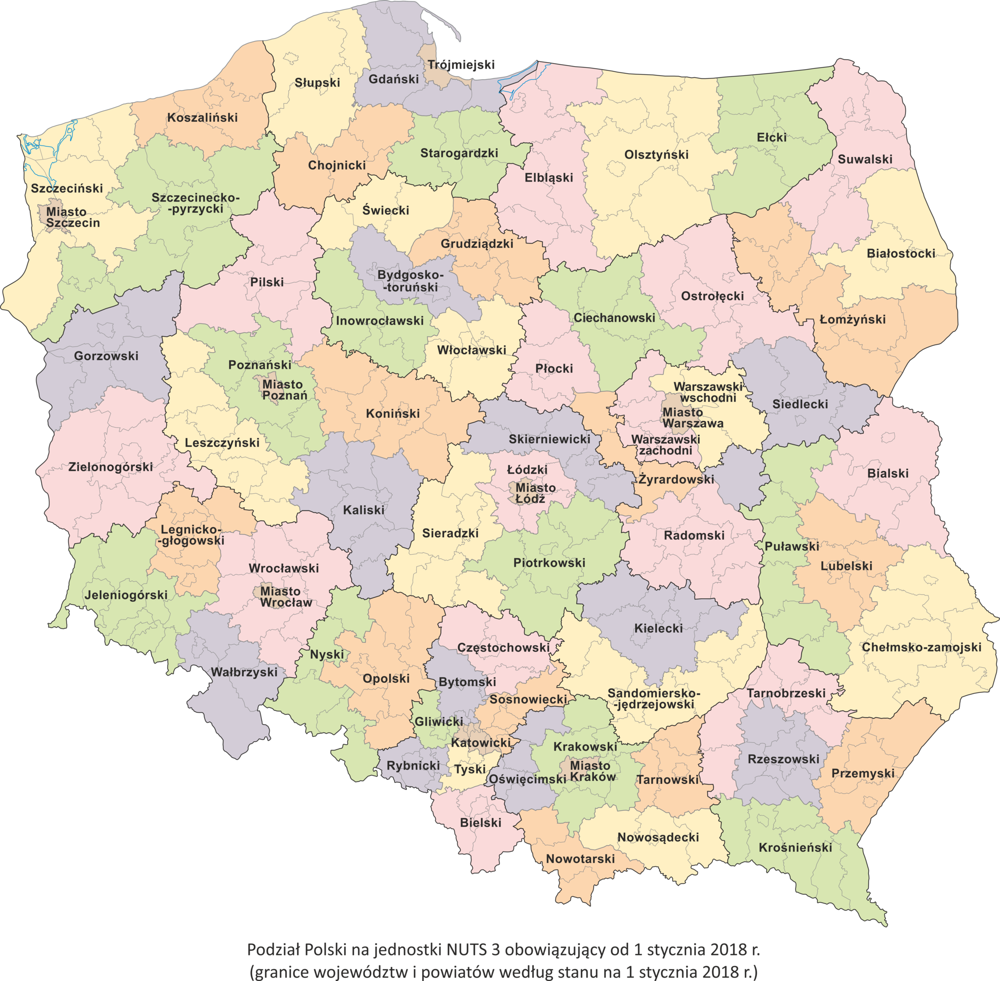

## Theory of Polish voting system

### Lower House (Sejm)

General supervision of any election is provided by government-independent 
Central Election Commission (manned by judges mainly)

41 multi-member constituencies (7--19 seats). A total of 460 seats. As population
of Poland is ca 38 million, there is 80 thousand people per seat (not voters)

Proportional voting system: All 460 members are elected by
proportional representation, distribution of seats being effected on
the basis of the modified Saint-Lague method; 

Parties win seats according to the aggregate vote for their candidates **in a
constituency**, and then allocate them to those with highest totals.

Election lists are registered by **election committees** (temporary body
established by anyone interested to be elected, usually by parties/coalition
of parties). Election list can contains maximum twice the number of seats (in every constituency)

For example Kwidzyn is in constutuency no 25 with 12 seats available. Every
election committee can appoint up to 24 candidates.

There are thresholds for participation in allocation of seats: 5% of
the total votes cast for party list; 8% for a coalition list. National
minorities' lists are exempt from thresholds requirements (still have to gain significant number
of votes in a constituancy to win some seats).

Vacancies arising between general elections are filled by the
individual who is "next-in-line" on the list of the party which
formerly held the seat.

Voting is not compulsory.


### Upper House (Senat)

100 single-member constituencies (1 senator per 200 thousand people.)

Majority: Single member plurality system ("first past the post").

Vacancies arising between general elections are filled through
by-elections (except in the last six months 
of the legislature's term).

Voting is not compulsory.

### Local elections

Poland has 3thier administrative system which consists of: municipalities (gmina)
counties (powiat) and province (voivodeships/województwo). 
There are 2478 gminas, 380 powiats and 16 voivodships. 

Municipalities are run by a **mayor** (**directly elected**). Municipalties
size varies enormously: the biggest gmina in Poland is Warsaw (1,5mln people, 
5 mln EUR budget/year)

There are councils with very limited power at gmina/powiat level. At powiat
level the council elects powiat head (starosta).

There are council with significant power at voivodship level. The council
elects sort of local government and administer pretty lot of money.

Local elections:  2478 gmina mayors + councillors at all three above mentioned 
levels (together 4 elections).

Elections to voivodship councils are similar (in general) to elections to lower house
of Parliament. Election list can contains the number of seats plus 2 (in every constituency)
85 multi-member constituencies (5--8 seats). 
A total of circa 560 seats are filled. 

There are thresholds for participation in allocation of seats: 5% of
the total votes cast for party list (8% for a coalition list -- perhaps not sure).  
The level is computed for each voivodeships not for the whole country.

As 90% or more seats are filled by mayor political parties, elections to VC
can be regarded as another contest between Polish main political parties.

## TERYT

There are 16 provinces, 380 counties and 2750 communities in Poland (as you know already). 

As Poland population is 38,5 mln and the area equals 312,7
sq kilometers (120 persons per 1 sqkm) on the average each powiat has 820 sqkm and each community
has 113.5 sqkm or approximately 100 thousand persons per "powiat and 14 thousand per "gmina".

Province in Polish is "prowincja" (due to both are from Latin) but actually 
Polish administrative provice is called "województwo", from "wodzić" -- ie commanding (the armed 
troops in this context).  This is an old term/custom from the 14th century, 
where Poland was divided into provinces (every province
ruled by a "wojewoda" ie chief of that province). More can be found
at Wikipedia (cf [Administrative divisions of Poland](https://en.wikipedia.org/wiki/Administrative_divisions_of_Poland))

{width=80%}

A Polish county (called "powiat") is 2-nd level administrative unit. 
In ancient Poland powiat was called
"starostwo" and the head of a "starostwo was called "starosta". "Stary" means Old, so
"starosta" is an old (and thus wise) person. 
BTW the head of powiat is "starosta" as 600 years ago:-)

**TERYT** is an official register of the territorial division of Poland
It is complex system which includes
identification of administrative units. Every unit has (up to) a 7-digit id number: wwppggt
where ww = "województwo" id, pp = "powiat" id, gg = "gmina" id and "t" decodes **type-of-community**
(rural, municipal or mixed). Higher units has trailing zeros for irrelevant part of id, so
14 or 1400000 means the same; as well as 1205 and 1205000. Six numbers is enough to identify
a community (approx 2750 units).

Election system is two-thier 41/85 constituencies + **27,000** pooling stations.
Constituencies are designed in such a way that preserves powiat boundries (ie. constituency consists
of several powiats usually). 

Thus in practice proportionality of election is approximate...

## Resources and data

Primary source of data is Central Commision web page which 
all relevant registers: constituency/pooling stations details (addresses/boundries/number 
of inhabitants and voters),
candidates/committees details, turnout, number of invalid votes, etc...
(https://pkw.gov.pl/ and/or https://wybory.gov.pl/sejmsenat2019/)

http://archive.ipu.org/

https://nsd.no/european_election_database/country/poland/parliamentary_elections.html

## How proportional are proportional elections in Poland?

File `obwody2011pkw2019gus.csv` contains data on 41 constituencies including population and number
of seats (lmandatow), number of voters (wyborcy2019), population (mieszkancy2019 and ludnosc2018gus):

```{r message=F, echo=F, warning=F}
pkw <- read.csv("obwody2011pkw2019gus.csv", sep = ';',  header=T, na.string="NA");
total2019w <- sum(pkw$wyborcy2019)
total2019m.gus <- sum(pkw$ludnosc2018.gus)
total2019m.pkw <- sum(pkw$mieszkancy2019)
pop.diff <- total2019m.gus - total2019m.pkw
cbind (total2019w, total2019m.gus, total2019m.pkw)
```
The variable `mieszkancy2019` contains population as registerd in PESEL system
(cf https://en.wikipedia.org/wiki/PESEL) while `ludnosc2018.gus` contains
population as estimated by Polish Central Statistical Office. 
Note the difference (`r pop.diff` or `r pop.diff/total2019m.pkw*100`%).
PKW uses PESEL-variant of population statistics.

```{r message=F, echo=F, warning=F}
require(ggplot2)

bar.color <- "blue";
okr.scale <- c(250, 500, 750, 1000, 1250, 1500, 1750) * 1000
ggplot(pkw, aes(x = reorder(okrnr, wyborcy2019), y=wyborcy2019 )) +
  ggtitle("Constituencies by total number of voters: (PKW/2019)") +
  #geom_bar(stat="identity", color=bar.color, fill=bar.color,  alpha=.5  ) +
  geom_bar(stat="identity", fill=bar.color,  alpha=.5  ) +
  scale_y_continuous(breaks=okr.scale) +
  xlab(label="okręg") +
  ylab(label="#") +
  coord_flip()+
  theme(plot.title = element_text(hjust = 0.5))
```

Number of seats as assigned by PKW (based on PESEL/2011 register):

```{r message=F, echo=F, warning=F}
mandat.scale <- c( 6, 7, 8, 9, 10, 11, 12, 13, 14, 15, 16, 17, 18, 19, 20, 21)

ggplot(pkw, aes(x = as.factor(okrnr), y=mandaty)) +
  ggtitle("Constituencies by number of seats assigned") +
  geom_bar(stat="identity", fill = bar.color, alpha=.5) +
  geom_text(data=pkw, aes(label=sprintf("%i", mandaty), y= mandaty), vjust=-1.25, size=3 ) +
  ylab(label="#") +
  xlab(label="okręg") +
  scale_y_continuous(breaks=mandat.scale) +
  theme(legend.title=element_blank()) +
  theme(legend.position="top")
```


Number of residents per seat (GUS vs PKW, thousand residents): `r total2019m.gus/460/1000` vs `r total2019m.pkw/460/1000`.

```{r message=F, echo=F, warning=F}
diff.scale <- c( -240, -220, -200, -180, -160, -140, -120, -100, -80, -60, -40, -20,
   0, 20, 40, 60, 80, 100, 120, 140, 160, 180, 200, 220, 240 ) * 1000

mpp2019pkw <- pkw$wyborcy2019 / total2019w * 460
mpp2019gus <- pkw$ludnosc2018.gus/ total2019m.gus * 460
mpp2019pkw.ludnosc <- pkw$mieszkancy2019 / total2019m.pkw * 460

ggplot(pkw, aes(x = as.factor(okrnr))) +
  ggtitle("Seats assigned: PKW vs GUS (PKW/2019 / GUS/2018)") +
  geom_point(aes(y = mpp2019pkw, colour = 'pkw', alpha=.5), size=2.5) +
  geom_point(aes(y = mpp2019gus, colour = 'gus', alpha=.5), size=2.5) +
  geom_point(aes(y = mandaty, colour = 'PKW/seats', alpha=.5), size=3) +
  geom_text(data=pkw, aes(label=sprintf("%i", okrnr), y= mandaty, x=as.factor(okrnr)), vjust=-1.25, size=3 ) +
  ylab(label="#") +
  xlab(label="constituency") +
  scale_y_continuous(breaks=mandat.scale) +
  theme(legend.title=element_blank()) +
  theme(legend.position="top")

```

Finally lets plot the differences between and number of seats as assigned by PKW based on 2011 data
and *true* number of seats as computed using PKW2019 data (voters) / GUS2018 data (residents)  (ie 
`assignedSeats - trueSeats`). Negative difference represents lack of seats while
positive one a surplus.

```{r message=F, echo=F, warning=F}
pkw$mpp2019pkw <- mpp2019pkw
pkw$mpp2019gus <- mpp2019gus
pkw$mpp2019pkw.ludnosc <- mpp2019pkw.ludnosc

pkw$diff.w <- pkw$wyborcy2011 - pkw$wyborcy2019
pkw$diff.m <- pkw$mieszkancy2011 - pkw$mieszkancy2019

pkw$m.diff.pkw <- pkw$mandaty - pkw$mpp2019pkw
pkw$m.diff.gus <- pkw$mandaty - pkw$mpp2019gus
pkw$m.diff.pkw.pkw  <- pkw$mpp2019pkw.ludnosc - pkw$mandaty

ggplot(pkw, aes(x = as.factor(okrnr))) +
  ggtitle("Seat assigned differences (PKW vs GUS)") +
  geom_point(aes(y = m.diff.pkw, colour = 'pkw/voters'), size=2.5) +
  geom_point(aes(y = m.diff.gus, colour = 'gus/residents'), size=2.5) +
  geom_text(data=pkw, aes(label=sprintf("%s", okrnr), y= m.diff.pkw), vjust=-1.25, size=2.0 ) +
  ylab(label="#") +
  xlab(label="okręg") +
  theme(legend.title=element_blank()) +
  theme(legend.position="top")

```


## Distribution of turnout (Oct/2019 elections)

Turnout is computed as `valid_votes + invalid_votes / registered_voters`.

First compute basic descriptive statistics (`fivenum` returns min/q1/median/q3/max)

BTW `lgw` is number of valid votes (*liczba głosów ważnych*),
`freq` is turnout (%) and `pgnw` is frequency of non valid votes (%):

```{r message=F, echo=F, warning=F}
#library(ggplot2)
library(ggpubr)

d <- read.csv("WP2019_KO.csv", sep = ';',  header=T, na.string="NA");
d$pgnw <- d$lgnw / (d$lgnw + d$lgw ) * 100
```
```{r message=F, echo=T, warning=F}
fivenum(d$lgw)
mean(d$lgw, na.rm=TRUE)
fivenum(d$freq)
mean(d$freq, na.rm=TRUE)
```

We can use histogram and frequency polygon (freqpoly) to
plot relevant distributions:

```{r message=F, echo=F, warning=F}
##pdf(file="komisje-frekwencja2019.pdf", onefile = TRUE);

p1.freq <- ggplot(d, aes(x=freq)) +
    ggtitle("Elections 2019: turnout", subtitle="(N = 27859 stations)") +
    xlab(label="") + ylab(label="stations") +
    scale_x_continuous(limits = c(0, 100)) +
    geom_histogram(binwidth=1, fill="steelblue", alpha=.5)

p2.freq <- ggplot(d, aes(x=pgnw)) +
    ggtitle("Elections 2019: non-valid votes (%)", subtitle="(N = 27859 stations)") +
    xlab(label="") + ylab(label="stations") +
    scale_x_continuous(limits = c(0, 100)) +
    geom_histogram(binwidth=1, fill="steelblue", alpha=.5)

p3.freq <- ggplot(d, aes(x=lgw)) +
    ggtitle("Elections 2019: number of valid votes", subtitle="(N = 27859 stations)") +
    xlab(label="") + ylab(label="N") +
    ##scale_x_continuous(limits = c(0, 100)) +
    geom_histogram(binwidth=10, fill="steelblue", alpha=.5)

p4.freq <- ggplot(d, aes(x=lgw)) +
    ggtitle("Elections 2019: number of valid votes", subtitle="(N = 27859 stations)") +
    xlab(label="") + ylab(label="stations") +
    ##scale_x_continuous(limits = c(0, 100)) +
    geom_freqpoly(binwidth=10, size=.5, position="identity")
##    geom_histogram(binwidth=50, fill="steelblue", alpha=.5)
##ggarrange(p1.freq, p2.freq, p3.freq, p4.freq, ncol = 2, nrow = 2)

p1.freq
p2.freq
p3.freq
p4.freq
```

Number of stations with low turnout (`lgw < 25`):

```{r message=F, echo=T, warning=F}
d <- subset (d, ( lgw < 25 ))
nrow(d)
```


## Description of election results (Oct/2019 elections)

The file `wp2019_komisje_wyniki.csv` contains election results at pooling station level.

There are four mainstream political parties in Poland. 
PiS (Law and Justice, cf https://en.wikipedia.org/wiki/Law_and_Justice),
PO (Civic Platform, cf https://en.wikipedia.org/wiki/Civic_Platform), 
PSL (agrarian People's Party, cf https://en.wikipedia.org/wiki/Polish_People%27s_Party) 
and SLD (Left Alliance, cf https://en.wikipedia.org/wiki/Democratic_Left_Alliance)

```{r message=F, echo=F, warning=F}
estimatedMode <- function(x) { d <- density(x, na.rm=T); d$x[which.max(d$y)] }

showVotes <- function(df, x, co, N, minN) {
   ## showVotes = plots histogram with description
   kN <- nrow(df)
   sX <- summary(df[[x]], na.rm=TRUE);
   sV <- sd(df[[x]], na.rm=TRUE)
   ## Pearson's skewness coefficient
   skewness <- 3 * (sX[["Mean"]] - sX[["Median"]])/sV
   Mo <- estimatedMode(df[[x]])
   skewnessMo <- (sX[["Mean"]] - Mo)/sV

   summary_label <- sprintf ("Śr = %.1f\nMe = %.1f\nq1 = %.1f\nq3 = %.1f\nS = %.1f\nW = %.2f",
     sX[["Mean"]], sX[["Median"]],
     sX[["1st Qu."]], sX[["3rd Qu."]], sV, skewness)
   summary_label_bold <- sprintf ("D = %.2f\nSr - D = %.2f\nWd = %.2f", Mo, sX[["Mean"]] - Mo, skewnessMo)

   if (minN < 1) {
   t <- sprintf("Elections 2019. Support for %s\nTotal %d stations", co, kN ) }
   else { t <- sprintf("Elections 2019. Support for %s\nTotal %d stations (N>%d)", co, kN, minN ) }

   h <- hist(df[[x]], breaks=kpN, freq=TRUE, col="orange", main=t,
     ylab="stations", xlab="votes for (%)", labels=F, xaxt='n' )
     axis(side=1, at=kpN, cex.axis=2, cex.lab=2)
    ## pozycja tekstu zawierającego statystyki opisowe
   posX <- .50 * max(h$counts)
   posY <- .66 * max(h$counts)
   text(80, posX, summary_label, cex=1.4, adj=c(0,1) )
   text(80, posY, summary_label_bold, cex=1.4, adj=c(0,1), font=4)
}
```

First compute basic descriptive statistics (`fivenum` returns min/q1/median/q3/max)

```{r message=F, echo=T, warning=F}
## Wczytanie danych; obliczenie podst. statystyk:
komisje <- read.csv("wp2019_komisje_wyniki.csv", 
                    colClasses = c( "teryt"="character"), sep = ';', header=T, na.string="NA");
fivenum(komisje$PSLp); 
fivenum(komisje$PiSp); 
fivenum(komisje$POp);
```

Distribution of votes at pooling stations level:

```{r message=F, echo=F, warning=F}
par(ps=6,cex=1,cex.axis=1,cex.lab=1,cex.main=1.2)
kpN <- seq(0, 100, by=2);
kpX <- c(0, 10,20,30,40,50,60,70,80,90, 100);
kN <- nrow(komisje)
region <- ""
minTurnout <- 0

showVotes(komisje, "PSLp", "PSL", kN, minTurnout);
showVotes(komisje, "PiSp", "PiS", kN, minTurnout);
showVotes(komisje, "POp",  "PO", kN, minTurnout);
showVotes(komisje, "SLDp", "SLD", kN, minTurnout);
```

Or with frequency polygon we can plot all four at once (comparison):

```{r message=F, echo=F, warning=F}
bw <- 2
ggplot() +
  geom_freqpoly(data = komisje, 
                mapping = aes(x = PiSp, y = ..count.., color = "PiS"), size=1, binwidth=bw)  +
  geom_freqpoly(data = komisje, 
                mapping = aes(x = POp, y = ..count.., color = "PO"), size=1, binwidth=bw)  +
  geom_freqpoly(data = komisje, 
                mapping = aes(x = SLDp, y = ..count.., color = "SLD"), size = 1, binwidth=bw)  +
  geom_freqpoly(data = komisje, 
                mapping = aes(x = PSLp, y = ..count.., color = "PSL"), size = 1, binwidth=bw)

## https://stats.stackexchange.com/questions/280589/how-to-effectively-visualize-multiple-frequency-polygons-in-ggplot2
```


Compare support for PiS/PO/PSL/SLD by province (województwo):

```{r message=F, echo=F, warning=F}
komisje$woj <- substr(komisje$teryt, 1,2)

p.pis <- ggplot(komisje, aes(x=as.factor(woj), y=PiSp, fill=as.factor(woj))) + geom_boxplot() +
  scale_y_continuous(limits=c(0,100)) +
  ggtitle("Support for PiS") +
  guides(fill=guide_legend("")) +
  ylab(label="%") +
  xlab("województwo");

p.po <- ggplot(komisje, aes(x=as.factor(woj), y=POp, fill=as.factor(woj))) + geom_boxplot() +
  scale_y_continuous(limits=c(0,100)) +
  ggtitle("Support for PO") +
  guides(fill=guide_legend("")) +
  ylab(label="%") +
  xlab("województwo");

p.sld <- ggplot(komisje, aes(x=as.factor(woj), y=SLDp, fill=as.factor(woj))) + geom_boxplot() +
  scale_y_continuous(limits=c(0,100)) +
  ggtitle("Support for SLD") +
  guides(fill=guide_legend("")) +
  ylab(label="%") +
  xlab("województwo");

p.psl <- ggplot(komisje, aes(x=as.factor(woj), y=PSLp, fill=as.factor(woj))) + geom_boxplot() +
  scale_y_continuous(limits=c(0,100)) +
  ggtitle("Support for PSL") +
  guides(fill=guide_legend("")) +
  ylab(label="%") +
  xlab("województwo");

ggarrange(p.pis, p.po, p.sld, p.psl, ncol = 2, nrow = 2)
```

## Concentration of votes (for top candidates, Oct/2019 elections)

Well known observed phenomenon of proportional scheme is concentration of votes at the top (or sometimes bottom) of the list. Elections in Poland are no exception to this.

The file `kandydaci_sejm_2019_f4.csv` contains total votes for every candidate from
4 mainstream Polish parties (PiS/PO/PSL/SLD -- 4 riders of apocalypse in short 4RA). 
The data is organized as follows:
```
1;1;PSL;ŻUK Stanisław Adam;7694;1.78;24.81;T;M
1;2;PSL;SAMBORSKI Tadeusz;5703;1.32;18.39;N;M
...
```
Columns contains: constituency number, candidate  number (on election ballot),
candidate name, number of votes, 
%% of valid votes in constituency, 
%% of valid votes from candidate's list,
outcome (T=elected; N=not elected), sex (M=male, K=female)

We start from ploting a boxplot

```{r message=F, echo=F, warning=F}
library(dplyr)

barColor <- "#8a0303"
##################################################################
xxx.limits <- c(0, 20)
xxx.breaks <- seq(0, 30, by = 2)
dft.limits <- c(0, 250)
dft.breaks <- seq(0, 250, by = 10)
##################################################################

kandydaci <- read.csv("kandydaci_sejm_2019_f4.csv", sep = ';',  header=T, na.string="NA");

kk <- kandydaci
kkNN <- nrow(kandydaci)

tit <- "2019 elections: PiS/PO/PSL/SLD"
ggplot(kk, aes(x=as.factor(nrk), y=glosy, fill=as.factor(nrk))) +
  geom_boxplot() +
  ggtitle(tit, subtitle="PO/PiS/SLD/PSL/") +
  ylab("votes") +
  ## https://stackoverflow.com/questions/11724311/how-to-add-a-ggplot2-subtitle-with-different-size-and-colour
  theme(plot.subtitle=element_text(size=8)) +
  xlab("list number");
```

BTW there are `r kkNN` candidates from 4RA (out of 5100 in total). The readability of a chart is 
poor due to a few extreme values:

```{r message=F, echo=T, warning=F}
fivenum(kk$glosy)
```

We can remove extreme values (glosy >= 125000) and replot the chart. There are exactly 6 cases
with glosy > 125000:

```{r message=F, echo=T, warning=F}
kk <- filter (kandydaci, glosy < 125000)
nrow(kk)
```

```{r message=F, echo=F, warning=F}
tit <- "2019 elections"
ggplot(kk, aes(x=as.factor(nrk), y=glosy, fill=as.factor(nrk))) +
  geom_boxplot() +
  ggtitle(tit, subtitle="PO/PiS/SLD/PSL/ votes < 125000") +
  ylab("votes") +
  ## https://stackoverflow.com/questions/11724311/how-to-add-a-ggplot2-subtitle-with-different-size-and-colour
  theme(plot.subtitle=element_text(size=8)) +
  xlab("list number");

kk <- filter(kandydaci, ((komitet=="PO" | komitet=="PiS") & glosy < 125000))
```

Replot the chart once more this time only for PiS and PO:

```{r message=F, echo=F, warning=F}
kk <- filter(kandydaci, ((komitet=="PO" | komitet=="PiS") & glosy < 125000))

tit <- "2019 elections"
ggplot(kk, aes(x=as.factor(nrk), y=glosy, fill=as.factor(nrk))) +
  geom_boxplot() +
  ggtitle(tit, subtitle="PO/PiS votes < 125000") +
  ylab("votes") +
  ## https://stackoverflow.com/questions/11724311/how-to-add-a-ggplot2-subtitle-with-different-size-and-colour
  theme(plot.subtitle=element_text(size=8)) +
  xlab("list number");
```

Final chart (4RA but only for Pomorskie province ie 25/26 constituences):

```{r message=F, echo=F, warning=F}
kk <- filter (kandydaci, okr == 25 | okr == 26)

tit <- "2019 elections"
ggplot(kk, aes(x=as.factor(nrk), y=glosy, fill=as.factor(nrk))) +
  geom_boxplot() +
  ggtitle(tit, subtitle="PO/PiS/SLD/PSL/ okr 26/25 (Pomorskie) votes < 125000") +
  ylab("votes") +
  ## https://stackoverflow.com/questions/11724311/how-to-add-a-ggplot2-subtitle-with-different-size-and-colour
  theme(plot.subtitle=element_text(size=8)) +
  xlab("list number");
```

### HH-Index of concentration

The concentration can be assessed not only visually, but 
estimated more precisley with some coefficient. The default
measure of concentration is Gini Index. We will use other well known 
measure of concentration ie. Herfindahl-Hirschman Index (HH-Index)
as it is much easier to compute
(cf https://en.wikipedia.org/wiki/Herfindahl%E2%80%93Hirschman_Index)

The HHI formula is as follows $HH = \sum_{i=1}^N x_i^2$ where $\sum_{i=1}^N x_i =100$%.

The file `HHsejm_2015_2019.csv` contains various concentration measures including
HH-Index computed for every party/constituency/election (where constituency=1..41, and election={2005,2007,2011,2015,2019}). We can plot HH values for 2019 election with bar-plot:

```{r message=F, echo=T, warning=F}
#library(ggplot2)
#library(dplyr)
library(data.table)
options(dplyr.print_max = 1e9)

okr.scale <- seq(0, 42, by=2);
diff.scale <- seq(0, 30, by=2);


hh <- read.csv("HHsejm_2005_2019.csv", sep = ';',  header=T, na.string="NA");
str(hh)

hh.okr <- hh %>% group_by(okr) %>% summarise_at(vars("hhPO", "hhPiS", "hhSLD", "hhPSL"), mean) %>% as.data.frame

str(hh.okr)

ggplot(hh.okr, aes(x = okr)) +
    ggtitle("Average HH 2005--2019", 
            subtitle="3:Wroc 9:Łódź, 19/20:Wwa 12/13:Krk 15:Tarnów 23: Rzeszów") +
    ###
    geom_point(aes(y = hhPO,  colour = 'PO'),  size=2, alpha=.5) +
    geom_point(aes(y = hhPiS, colour = 'PiS'), size=2, alpha=.5) +
    geom_point(aes(y = hhSLD, colour = 'SLD'), size=2, alpha=.5) +
    geom_point(aes(y = hhPSL, colour = 'PSL'), size=2, alpha=.5) +
    ## labels
    ylab(label="HH") +
    xlab(label="constituence") +
    labs(colour = "Party: ") +
    scale_x_continuous(breaks=seq(0,42, by=2)) +
    scale_y_continuous(breaks=seq(0,8000,by=1000), limits = c(0,8000))+
    theme(legend.position="top") +
    theme(legend.text=element_text(size=12));
```


The same as above but for 2019 only:

```{r message=F, echo=F, warning=F}
hh <- filter (hh, rok == 2019)
hh.okr.2019 <- hh %>% group_by(okr) %>% summarise_at(vars("hhPO", "hhPiS", "hhSLD", "hhPSL"), mean) %>% as.data.frame

ggplot(hh.okr.2019, aes(x = okr)) +
    ggtitle("HH 2019", subtitle="3:Wroc 9:Łódź, 19/20:Wwa 12/13:Krk 15:Tarnów 23: Rzeszów") +
    ###
    geom_point(aes(y = hhPO,  colour = 'PO'),  size=2, alpha=.5) +
    geom_point(aes(y = hhPiS, colour = 'PiS'), size=2, alpha=.5) +
    geom_point(aes(y = hhSLD, colour = 'SLD'), size=2, alpha=.5) +
    geom_point(aes(y = hhPSL, colour = 'PSL'), size=2, alpha=.5) +
    ## labels
    ylab(label="HH") +
    xlab(label="constituence") +
    labs(colour = "Party: ") +
    scale_x_continuous(breaks=seq(0,42, by=2)) +
    scale_y_continuous(breaks=seq(0,8000,by=1000), limits = c(0,8000))+
    theme(legend.position="top") +
    theme(legend.text=element_text(size=12));
```

Extreme concentration can cause some odd results. For example MPs are elected with extremly low support
(a few thousand votes):

```{r message=F, echo=T, warning=F}
kk <- filter (kandydaci, glosy < 6666 & wynik == "T")
print (kk)
```

## Voters voting outside the district of permanent residence


wgpp -- voters voting by proxy (disabled persons);
wgnpzpg -- voters voting outside district of permanent residence

```{r message=F, echo=T, warning=F}

kk <- read.csv("komisje-wyniki-frekwencja-2019.csv", sep = ';',  header=T, na.string="NA");

sum(kk$wgnpzpg)
```

```{r message=F, echo=T, warning=F}
pz.pis <- ggplot(kk, aes(x = wgnpzpg, y=PiSp )) +
  geom_point(colour = 'blue', alpha=.4) +
  ggtitle("PiS vs wgnpzpg") +
  theme(plot.title = element_text(hjust = 0.5)) +
  xlab(label="wgnpzpg") +
  ylab(label="PiSp") +
  scale_y_continuous(limits = c(0, 100)) +
  geom_smooth(method = "lm", colour = 'black')

pz.po <- ggplot(kk, aes(x = wgnpzpg, y=POp )) +
  geom_point(colour = '#E69F00', alpha=.4) +
  ggtitle("PO vs wgnpzpg") +
  theme(plot.title = element_text(hjust = 0.5)) +
  xlab(label="wgnpzpg") +
  ylab(label="PO") +
  scale_y_continuous(limits = c(0, 100)) +
  geom_smooth(method = "lm", colour = 'black')

pz.sld <- ggplot(kk, aes(x = wgnpzpg, y=SLDp )) +
  geom_point(colour = '#56B4E9', alpha=.4) +
  ggtitle("SLD vs wgnpzpg") +
  theme(plot.title = element_text(hjust = 0.5)) +
  xlab(label="wgnpzpg") +
  ylab(label="SLD") +
  scale_y_continuous(limits = c(0, 100)) +
  geom_smooth(method = "lm", colour = 'black')

pz.psl <- ggplot(kk, aes(x = wgnpzpg, y=PSLp )) +
  geom_point(colour = '#636363', alpha=.4) +
  ggtitle("PSL vs wgnpzpg") +
  theme(plot.title = element_text(hjust = 0.5)) +
  xlab(label="wgnpzpg") +
  ylab(label="PSL") +
  scale_y_continuous(limits = c(0, 100)) +
  geom_smooth(method = "lm", colour = 'black')

ggarrange(pz.pis, pz.po, pz.sld, pz.psl, ncol = 2, nrow = 2)

```

PO/SLD have more determined voters?

Not neccessary. PO/SLD is more popular in cities and `wgnpzpg` voters
are urban not rural phenomenon...

## Who was the winner?

```{r message=F, echo=T, warning=F}
bar.color <- "blue";
okr.scale <- seq(0, 42, by=2);
okr.scaleD <- seq(0, 42, by=1);
diff.scale <- seq(0, 20, by=2);
diffp.scale <- seq(0, 100, by=10);

kk <- read.csv("kk2015_2019.csv", sep = ';',  header=T, na.string="NA");
kk <- kk %>% filter(komitet=="PiS" | komitet=="PO" | komitet=="SLD" | komitet=="PSL" | komitet == "KONF")  %>% as.data.frame

kk$diffm <- kk$m2019 - kk$m2015

p0 <- ggplot(data=kk, aes(x=as.factor(komitet), y=diffm, fill=komitet )) +
    geom_bar(stat="identity", position=position_dodge(width=.4), width=.8,  alpha=.5) +
  geom_text(data=kk, aes(label=sprintf("%s", diffm), y= diffm), vjust=-1.25, size=3 ) +
  theme(legend.position="top") +
  ylab(label="m2019 - m2015") +
  xlab(label="") +
  labs(caption = "Source: https://github.com/hrpunio/Data/tree/master/sejm2019") +
  ggtitle("Seats (2019 vs 2015)")

p1 <- ggplot(data=kk, aes(x=as.factor(komitet), y=m2019, fill=komitet )) +
    geom_bar(stat="identity", position=position_dodge(width=.4), width=.8,  alpha=.5) +
  geom_text(data=kk, aes(label=sprintf("%s", m2019), y= m2019), vjust=-1.25, size=3 ) +
  #scale_x_continuous(breaks=seq(1,41,by=1), limits = c(1,41)) +
  #scale_y_continuous(breaks=seq(-8,18,by=2), limits = c(-3,15)) +
  theme(legend.position="top") +
  ylab(label="m2019") +
  xlab(label="") +
  labs(caption = "Source: https://github.com/hrpunio/Data/tree/master/sejm2019") +
  ggtitle("Seats 2019")

p1
p0
```

Election commitees are in fact coalitions (formal or informal to lower entry threshold)

If we are counting elected party members (not election commitees)
the figures are as follows (4RA):

```{r message=F, echo=F, warning=F}
library(stringr)
library(data.table)
options(dplyr.print_max = 1e9)

kk <- read.csv("kandydaci_wyniki_2015_2019.csv", sep = ';',  header=T, na.string="NA");
kk <- kk %>% filter(komitet=="PiS" | komitet=="PO" | komitet=="SLD" | komitet=="PSL"
  | komitet == "PETRU" | komitet == "KUKIZ" | komitet == "KONF" | komitet == "KO")  %>% as.data.frame
##kk <- mutate (partia = recode(partia, "" = 3, "neutral" = 2))
kk <- kk %>% mutate(partia=str_replace(partia, "Polska Razem Zjednoczona Prawica", "PJGowina")) %>% as.data.frame()
kk <- kk %>% mutate(komitet=str_replace(komitet, "KO", "PO")) %>% as.data.frame()

kk <- kk %>% filter(partia=="PiS" | partia=="PO" | partia=="SLD" | partia=="PSL"
  | partia=="PJGowina" | partia=="SolidarnaPolska" | partia=="Wiosna" | partia == "Twój Ruch"
  | partia=="PJGowina" | partia=="ZIELONI" | partia == "Zieloni"
  | partia=="Nowoczesna" | partia=="LewicaRazem"
  | partia == "BEZPARTYJNY")  %>% as.data.frame

kk.gg <- group_by (kk, rok, komitet, partia) %>% summarise( n = n()) %>% as.data.frame

## tylko wybrani z 4 partii
kk <- kk %>% filter((partia=="PiS" | partia=="PO" | partia=="SLD" | partia=="PSL") & (mandat=="t")) %>% as.data.frame

kk.pp.2019 <- group_by (kk, rok, komitet, partia) %>% summarise( n = n()) %>% filter (rok==2019) %>% as.data.frame
kk.pp.2015 <- group_by (kk, rok, komitet, partia) %>% summarise( n = n()) %>% filter (rok==2015) %>% as.data.frame

newRow2015.sld <- data.frame(rok=2015, komitet='SLD', partia='SLD', n=0)
kk.pp.2015 <- rbind(kk.pp.2015, newRow2015.sld)
##str(kk.pp.2019)

ggplot(data=kk.pp.2019, aes(x=as.factor(partia), y=n, fill=partia )) +
  geom_bar(stat="identity", position=position_dodge(width=.4), width=.8,  alpha=.5) +
  geom_text(data=kk.pp.2019, aes(label=sprintf("%s", n), y= n), vjust=-1.25, size=3 ) +
  theme(legend.position="top") +
  ylab(label="seats") +
  xlab(label="") +
  labs(caption = "Source: https://github.com/hrpunio/Data/tree/master/sejm2019") +
  ggtitle("Seats 2019")

kk.pp.2019$n2015 <- kk.pp.2015$n
kk.pp.2019$diff <- kk.pp.2019$n - kk.pp.2019$n2015

ggplot(data=kk.pp.2019, aes(x=as.factor(partia), y=diff, fill=partia )) +
  geom_bar(stat="identity", position=position_dodge(width=.4), width=.8,  alpha=.5) +
  geom_text(data=kk.pp.2019, aes(label=sprintf("%s", diff), y= diff), vjust=-1.25, size=3 ) +
  theme(legend.position="top") +
  ylab(label="seats") +
  xlab(label="") +
  labs(caption = "Source: https://github.com/hrpunio/Data/tree/master/sejm2019") +
  ggtitle("Seats difference (2019 - 2015)")
```


## Summary

We have described election results in Poland with **bar plot**, **box plot**, 
**dot plot**, **scatter plot**, **histogram**
and **frequency polygon**. We do not used pie chart as it is not recommended :-)
