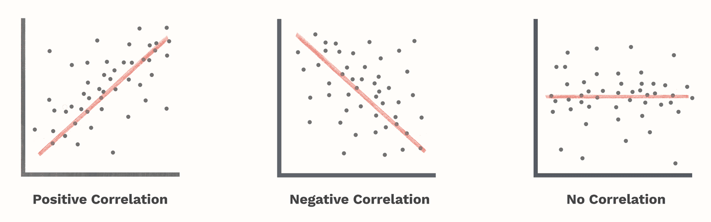

## Two approaches to statistical analysis

**Confirmatory**: seek answers to non-trival questions. Usually model based. 

**Exploratory**: seek answers to trival questions or seek questions.

**Descriptive statistics** (part of EA):  
summarizing/arranging/plotting the data so they can be easily understood.

## Basic descriptive measures 

**Measure of Central Tendency**: mean, median, mode, quartille

**Measure of Spread/Dispersion**: variance, standard deviation, interquartile range (IQR)

**Skewness**: (mean - mode)/s or 3(mean - Me)/s 

**Correlation**: 

{width=80%}

## Basic charts

**1-dimensional plots**: pie chart, bar plot, dot plot 

**2-dimensional plots**: scatter plot

**distribution**: histogram, frequency polygon, box plot

**Box-plot**: rectangle edges equal to quartilles with median in between;
whiskers equals to Q1/Q3 ± 1,5 IQR; outliers

{width=80%}

## Resources

https://github.com/hrpunio/Z2019
