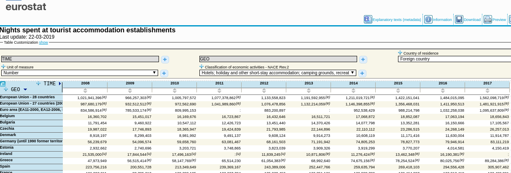
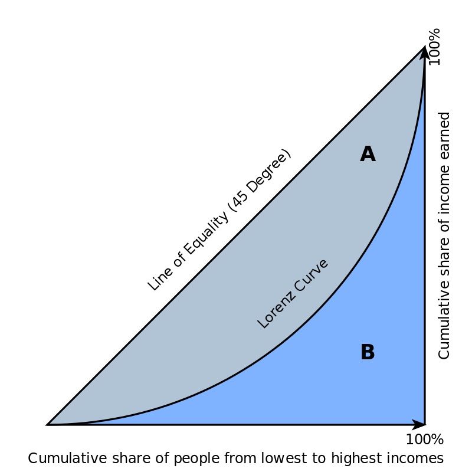

```{r setup, include=FALSE}
knitr::opts_chunk$set(echo = TRUE)
```

# Przedmiot, metody i organizacja badań statystycznych

## Przedmiot statystyki

**Statystyka**: analiza struktury, przedziały ufności i weryfikacja hipotez,
analiza współzależności.

**Etapy analizy statystycznej**: -- przełóż obserwacje na postać
liczbową -- wnioskuj (zastosuj odpowiednie statystyki)

**Analiza eksploracyjna**
Exploratory research is the stage of the research process that aims at
connecting ideas as to unveil the ``why''s of potential cause/effect
relationships. This occurs when researchers get started at
understanding what they are actually observing when in the process of
building cause/effect models. 

**Analiza konfirmacyjna**
Confirmatory research (a.k.a. hypothesis
testing) is where researchers have a pretty good idea of what's going
on. That is, researcher has a theory (or several theories), and the
objective is to find out if the theory is supported by the facts.

**Opis statystyczny** -- liczbowe przedstawienie badanych zbiorowości lub
zjawisk w postaci opisu: -- tabelarycznego; -- graficznego; -- parametrycznego

**Opis statystyczny** może dotyczyć: -- struktury zbiorowości; --
współzależności; -- zmian zjawisk w czasie.

**Badanie statystyczne** to zespół czynności zmierzających do
uzyskania (za pomocą metod statystycznych) informacji
charakteryzujących badaną zbiorowość lub zjawisko.  Najważniejsze
kryteria klasyfikacji badań: -- zakres obserwacji badanych jednostek
(pełne, częściowe); -- częstotliwość: (ciągłe, okresowe, doraźne); --
zasięg przestrzenny (międzynarodowe, krajowe, regionalne,
środowiskowe, monograficzne); -- dziedzina badań (demograficzne,
społeczne, ekonomiczne, rolnicze, jakości środowiska naturalnego itp.

**Populacja, zbiorowość statystyczna**: zbiór obiektów (osób,
przedmiotów, zdarzeń) logicznie ze sobą powiązanych (ale nie
identycznych), poddany badaniu statystycznemu.

**Jednostka statystyczna**: jednostki statystyczne w danej populacji
różnią się od innych jednostek spoza danej populacji poprzez swoje
własności wspólne (cechy stałe), jednocześnie różnią się między sobą
cechami (cechy zmienne), które są przedmiotem zainteresowania badacza.

**Cechy statystyczne** -- właściwości jednostek statystycznych Cechy
stałe -- jednakowe dla wszystkich jednostek badania: rzeczowa (co?
kto? jest badane/y) przestrzenna (gdzie?)  czasowa (kiedy?)

**Cechy zmienne** -- właściwości różnicujące jednostki
jednostki z badanej populacji, tj. takie które mogą posiadać więcej niż 1 wariant
(jeżeli posiadają jeden mamy do czynienia z przypadkiem trywialnym). Cechy
zmienne dzielimy na: -- jakościowe (płeć, rok studiów) -- ilościowe (wiek)

**Pomiar** -- przyporządkowanie wariantom cechy zmiennej ustalonych liczb
lub symboli. W naukach przyrodniczych (fizyka, chemia) pomiaru dokonuje
przy zastosowaniu precyzyjnych/jednoznacznie określonych definicji **miar**.
W naukach społecznych jest niestety inaczej: wiele definicji jest 
nieprecyzyjnych (turysta), a wiele miar przybliżonych. 
Przy czym brak precyzji pomiaru nie wynika z błędu pomiaru (źle przyłożona linijka), 
ale jest cechą użytej **skali pomiarowej** (nieprecyzyjna linijka).

**Rodzaje skal pomiarowych** -- **nominalna** (nominal scale),
klasyfikuje: płeć; -- **porządkowa** (ordinal scale), klasyfikuje
i porządkuje: zdolność kredytowa firmy, stadia choroby,
-- **przedziałowa** (interval scale), posiada jeszcze stałą jednostkę
miary (ów przedział) oraz umowne zero (temperatura) -- **ilorazowa** (rational scale),
posiada to co przedziałowa plus naturalne zero (wiek, wzrost, obrót, temperatura).

Skala Kelvina temperatury jest ilorazowa, skala Celsiusza jest przedziałowa.
Zero w skali Kelvina to zero bezwzględne, 200K jest 2 razy mniejsze niż 400K
podczas gdy 200C nie jest dwa razy mniejsze niż 400C. Na skali 
przedziałowej **nie można** w bezpieczny sposób dokonywać dzielenia.
Na liczbach w skali porządkowej nie można dokonywać nawet dodawania.
**Wszystkie operacje arytmetyczne są bezpieczne tylko dla skali ilorazowej.**

**Cecha statystyczna mierzalna (ilościowa)** -- określana jest za
pomocą liczb np. oceny, płace. Cechy mierzalne dzielą się na skokowe
i ciągłe.  Skokowe są to cechy, które przyjmują skończoną liczbę
wartości, zwykle są to liczby całkowite; Ciągłe są to cechy, które
przyjmują dowolne wartości liczbowe z pewnego przedziału liczbowego
np. dochody, długość ziarna fasoli.

**Data wrangling**, sometimes referred to as **data munging**, is the
process of transforming and mapping data from one raw data form into
another format with the intent of making it more appropriate and
valuable for a variety of downstream purposes such as analytics.

**Data science** also known as data-driven science, is an
interdisciplinary field of scientific methods, processes, algorithms
and systems to extract knowledge or insights from data in various
forms, either structured or unstructured.

**Statistics**  Programs -> Data -> Knowledge

**Data Science** Data -> Programs -> Knowledge

Pojęcia stosowane w statystyce publicznej
https://stat.gov.pl/metainformacje/slownik-pojec/pojecia-stosowane-w-statystyce-publicznej/lista.html

## Rodzaje badań statystycznych

**Pełne** (spis, rejestracja), **częściowe** (reprezentacyjne),
**szacunki interpolacyjne i ekstrapolacyjne** (ustalenie wartości na podstawie
znanych wartości podobnych/poprzednich/sąsiednich; 
wbrew pozorom często stosowana metoda).

**Ciągłe** (ewidencja urodzeń), **okresowe** (spisy rolne, spis powszechny), 
**doraźne** (sondaż poparcia w wyborach prezydenckich)

**Spis** gromadzenie danych na potrzeby badania; **Rejestracja** gromadzenie danych przy
okazji wykonywania innych działań (ewidencja 
ludności, działanie wymiaru sprawiedliwości, gromadzenie danych pogodowych itp...)

**Reprezentacyjne** badanie oparte na **próbie** pobrane ze zbiorowości w taki sposób, 
że wyniki uzyskane dla tej próby można uogólnić na 
całą populację (wymaga to odpowiedniego sposobu wybrania jednostek do próby; nie każda
próba jest **reprezentacyjna**)

## Organizacja badań statystycznych

Etapy wstępne badania statystycznego:

* ustalenie **celu i metody** (pełne częściowe); 

* określenie **zbiorowości** i **jednostki badania**;

* określenie **cech/wartości cech** podlegających gromadzeniu (*definiowanie/klasyfikacja**) oraz sposobu pomiaru;

* zdefiniowanie **jednostki sprawozdawczej** (od kogo pozyskamy dane).

**Klasyfikacja** to ustalenie (wyodrębnienie) wariantów cechy.
Cechy/wartości cech nie mogą być wymyślane ad hoc ale (w imię porównywalności)
powinny być definiowane z użyciem powszechnie stosowanych 
słowników/taksonomii/klasyfikacji (TERYT, PESEL, EKD)

Kto to jest turysta? Co to jest hotel? Co to jest las?

**Pomiar** (obserwacja). **Materiał pierwotny** (dane zgromadzone specjalnie dla celów badania),
**materiał wtórny** (dane zgromadzone z innych powodów ale przydatne do badania statystycznego; dane rejestrowane). Wg Sobczaka: większą wartość 
mają materiały pierwotne, ponieważ są aktualne, gromadzone z określoną dokładością i nie
są obciążone zbytecznymi informacjami. Powyższe można uznać za mocno nieaktualne.
Współcześnie dane z rejestrów 
są coraz zarówno lepsze jakościowo jak i dominują ilościowo (Facebook/Google, którego
wszyscy się boją:-)).

## Opracowanie danych

**Grupowanie** -- podział zbiorowości na jednorodne lub względnie
jednorodne podgrupy z punktu widzenia wyróżnionej cechy (cech):
-- typologiczne (cechy jakościowe); -- wariancyjne (cechy ilościowe).

Zasady logiki formalnej: grupowanie musi być wyczerpujące -- każda
jednostka zbiorowości musi być sklasyfikowana i włączona do
odpowiedniej podgrupy; -- grupowanie powinno być rozłączne --
wyodrębnione podgrupy muszą się wzajemnie wykluczać; -- grupowanie
powinno być efektywne -- wyróżnione podgrupy powinny być na tyle
jednorodne jakościowo, by mogły stanowić podstawę twierdzeń
uogólniających

**Szereg statystyczny** to zbiorowość statystyczna (populacja)
uporządkowana (**szereg szczegółowy**) lub uporządkowana i pogrupowana (**Szereg rozdzielczy**) według określonych kryteriów (wariantów cechy).

Wg GUS (cf https://stat.gov.pl/metainformacje/slownik-pojec/pojecia-stosowane-w-statystyce-publicznej/2793,pojecie.html)
Ciąg wielkości statystycznych, otrzymanych w wyniku obserwacji statystycznej lub pomiaru, uporządkowanych według określonych kryteriów (cech) -- podstawowa 
forma prezentacji danych statystycznych.

Wyróżnia się następujące szeregi statystyczne: szereg szczegółowy, szereg rozdzielczy (**strukturalny**), szereg przestrzenny (geograficzny) 
i szereg czasowy (**dynamiczny**). 

Szereg strukturalny -- opis zbiorowości statystycznej w określonym momencie czasu
(wiek nowożeńców w powiecie kwidzyńskim w 2019 roku); szereg czasowy -- opis
zbiorowości w pewnych okresach (**strumieni**) lub momentach (**stan**) czasu.

Liczba urodzeń w powiecie kwidzyńskim w latach 2000--2019 to szereg czasowy okresów
(strumieni); w szczególności można dodać liczbę urodzeń w poszczególnych latach otrzymując
łączną liczbę urodzonych w tym okresie.

Liczba zarejestrowanych pojazdów w powiecie kwidzyńskim w latach 2000--2019 to szereg momentów (stan); nie można sumować liczby zarejestrowanych samochodów, bo taka suma nie ma merytorycznie sensu. Można podać średnią--przeciętny stan zarejestrowanych samochodów w latach 2000--2019.

**Szereg przestrzenny** (geograficzny) – przedstawia rozmieszczenie
wielkości statystycznych według podziału administracyjnego (gmina,
powiat, województwo, itd).

Szereg strukturalny: rozkład wartości cechy; szereg czasowy: zmiana wartości w czasie;
szereg przestrzenny rozkład cechy na powierzchni Ziemi.

Szereg rozdzielczy przestawia się zwykle w postaci **tablicy statystycznej**.

Szereg szczegółowy (przykład):

```
Gospodarstwa domowe wg liczby samochodów

0 0 0 0 0 0 0 ... 1 1 1 1 1 1 1 1 ...
```

Szereg rozdzielczy dla cechy niemierzalnej:

```
Tablica 1. Struktura próby mieszkańców wg wykształcenia

Wykształcenie liczba osób odsetek w %
-------------------------------------
podstawowe i gimnazjalne 130  13,0
zawodowe                 272  27,2
średnie                  444  44,5
wyższe                   153  15,3
Ogółem                   999 100,0
```

Szereg rozdzielczy punktowy:

```
Gospodarstwa domowe wg liczby samochodów

Liczba samochodów    Liczba gospodarstw
---------------------------------------
0                      230
1                      280
2                       70
3 i więcej               5
Razem                  585
```

Szereg rozdzielczy przedziałowy:

```
Studenci według czasu wolnego

Czas wolny w min.     Liczba osób
--------------------------------
30,1 - 60                      3
60,1 - 90                      4
90,1 - 120                     6
120,1 - 150                    5
150,1 - 180                    3
180,1 - 210                    1
Razem                         22
```

**Budowa tablic statystycznych**: 1. Część liczbowa (kolumny i
wiersze); 2. Część opisowa: -- tytuł tablicy; nazwy
wierszy; nazwy kolumn; -- źródło danych; -- ewentualne
uwagi odnoszące się do danych liczb.

## Wizualizacja danych i wykresy

**Wykresy statystyczne** są graficzną formą prezentacji materiału
statystycznego, są mniej precyzyjne i szczegółowe niż tablice,
natomiast bardziej sugestywne.

Rodzaje wykresów (podział ze względu na zastosowanie): 

**Jedna cecha**

szeregi strukturalne: punktowe, słupkowe, histogram, pudełkowe, kołowe (nie używać)

szeregi czasowe: liniowe

szeregi przestrzenne: kartogramy

**Dwie cechy**

wykres rozrzutu (scatter-plot), liniowy


# Analiza struktury

## Pojęcia wstępne

Analiza struktury -- opisane zbiorowości ze
względu na obserwowane w badaniu cechy zmienne.

Podstawę do oceny struktury zbiorowości stanowią dane w postaci
**szeregu szczegółowego**, bądź też pogrupowane (**szereg rozdzielczy**)

Analizę prowadzić można na podstawie wykresów, szeregów
rozdzielczych oraz (najczęściej) za pomocą odpowiednio obliczonych
charakterystyk, zwanych parametrami (dla populacji) lub
statystykami (dla próby).

**Rozkład cechy** -- przyporządkowanie liczby wystąpień (liczebności, częstości lub
prawdopodobieństwa) odpowiednim wartościom cechy zmiennej.

Analiza struktury obejmuje:
**określenie tendencji centralnej** (tzw. **miary położenia** / wartość przeciętna, mediana, dominanta);
**zróżnicowanie wartości** (rozproszenie);
**asymetrię** (rozłożenie wartości wokół średniej);
**koncentrację** (podział wartości cechy pomiędzy jednostki)

### Wykresy

Celem jest pokazanie rozkładu wartości cechy w populacji: jakie wartości występują
często a jakie rzadko, jak bardzo wartości różnią się między sobą. Jak różnią
się rozkłady dla różnych ale logicznie powiązanych populacji
(np rozkład czegoś-tam w kraju A i B albo w roku X, Y i Z).
Do tego celu stosuje się: **histogram** (albo wykres słupkowy dla skal nominalnych),
**wykres punktowy**, **wykres pudełkowy** oraz **kołowy**. Omówimy je na przykładach

**Przykład 1: Dzietność kobiet na świecie**

Współczynnik dzietności -- przeciętna liczba urodzonych dzieci przypadających na jedną kobietę w wieku rozrodczym (15–49 lat). Przyjmuje się, iż FR między 2,10–2,15 zapewnia zastępowalność pokoleń.

Plik `fertility_rate_2003_2018.csv` (źródło: https://ourworldindata.org/grapher/fertility-rate-complete-gapminder) zawiera wartości współczynnika w roku 2003 oraz 2018 (czyli po 15 latach) dla 202 krajów.

```{r message=FALSE, echo=FALSE}
library("ggplot2");
require("dplyr");

dA <- read.csv("fertility_rate_2003_2018.csv", sep = ';',
  header=T, na.string="NA");

boxp <- ggplot(dA, aes(x=as.factor(yr), y=frate, fill=as.factor(yr))) +
 geom_boxplot() +
 ylab("fr") +
 xlab("rok") +
 ggtitle("Współczynniki dzietności 2003 vs 2018") +
 theme(legend.position="none")

d2003 <- dA %>% filter(yr==2003) %>% as.data.frame

s2003 <- summary(d2003$frate)
##s2003

mean2003 <- s2003[["Mean"]]
median2003 <- s2003[["Median"]]
min2003 <- s2003[["Min."]]
max2003 <- s2003[["Max."]]

N2003 <- nrow(d2003)
d2003.low <- d2003 %>% filter(frate < 2.10) %>% as.data.frame
L2003 <- nrow(d2003.low)

d2018 <- dA %>% filter(yr==2018) %>% as.data.frame

s2018 <- summary(d2018$frate)
##s2018

mean2018 <- s2018[["Mean"]]
median2018 <- s2018[["Median"]]
srednia2018 <- s2018[["Mean"]]
min2018 <- s2018[["Min."]]
max2018 <- s2018[["Max."]]

N2018 <- nrow(d2018)
d2018.low <- d2018 %>% filter(frate < 2.10) %>% as.data.frame
L2018 <- nrow(d2018.low)
```

Do oceny rozkładu wartości zmiennej służy **histogram** (por https://pl.wikipedia.org/wiki/Histogram). Jeżeli
umieścimy obok siebie dwa (lub więcej) histogramy, możemy w ten sposób
porównać (wizualnie) dwa rozkłady:

```{r message=FALSE, echo=FALSE, warning=FALSE, fig.width=10}
library("ggpubr")

h2003 <- ggplot(d2003, aes(x = frate)) + geom_histogram(binwidth = 0.25) +
 ylab("N") +
 xlab("współczynnik dzietności") +
 ggtitle("Współczynniki dzietności 2003") +
 coord_cartesian(ylim = c(0, 30), xlim=c(0,8))

h2018 <- ggplot(d2018, aes(x = frate)) + geom_histogram(binwidth = 0.25) +
 ylab("N") +
 xlab("współczynnik dzietności") +
 ggtitle("Współczynniki dzietności 2018") +
 coord_cartesian(ylim = c(0, 30), xlim=c(0, 8))
ggarrange(h2003, h2018, ncol=2, nrow=1)
```

Kształt histogramu zależy od wyboru rozpiętości przedziału; im przedział węższy
tym więcej słupków (ale ich wysokość będzie mniejsza). Poniżej przedstawiono
ten sam rozkład dla rozpiętości przedziału równej odpowiednio 0,1, 0,25 oraz 0,5:

```{r message=FALSE, echo=FALSE, warning=FALSE, fig.width=10}


h2018a <- ggplot(d2018, aes(x = frate)) + geom_histogram(binwidth = 0.1) +
 ylab("N") +
 xlab("współczynnik dzietności") +
 ggtitle("Współczynniki dzietności 2018") +
 coord_cartesian(ylim = c(0, 30), xlim=c(0, 8))

h2018b <- ggplot(d2018, aes(x = frate)) + geom_histogram(binwidth = 0.25) +
 ylab("N") +
 xlab("współczynnik dzietności") +
 ggtitle("Współczynniki dzietności 2018") +
 coord_cartesian(ylim = c(0, 30), xlim=c(0, 8))

h2018c <- ggplot(d2018, aes(x = frate)) + geom_histogram(binwidth = 0.5) +
 ylab("N") +
 xlab("współczynnik dzietności") +
 ggtitle("Współczynniki dzietności 2018") +
 coord_cartesian(ylim = c(0, 50), xlim=c(0, 8))

ggarrange(h2018a, h2018b, h2018c, ncol = 3, nrow = 1)
```

Dlatego jeżeli porównujemy różne rozkłady za pomocą umieszczonych obok siebie
histogramów to powinny one mieć: tę samą rozpiętość przedziałów, te same skale na obu osiach.

Istnieją wzory na optymalną liczbę przedziałów ale nalepszą metodą jest metoda
prób i błędów.

Czasami jeżeli liczebność populacji nie jest za duża można spróbować 
przedstawić rozkład cechy na wykresie punktowym:

```{r message=FALSE, echo=FALSE}
dp2018 <- ggplot(d2018, aes(x = reorder(symbol, frate) )) +
  geom_point(aes(y = frate, colour = 'frate' ), size=1) +
  xlab(label="kraj") +
  ylab(label="wsp. dzietności") +
  ggtitle("Wsp dzietności 2018 wg krajów świata") +
  theme(axis.text = element_text(size = 4)) +
  theme(plot.title = element_text(hjust = 0.5)) +
  coord_flip(ylim = c(0, 8))


dp2003 <- ggplot(d2003, aes(x = reorder(symbol, frate) )) +
  geom_point(aes(y = frate, colour = 'frate' ), size=1) +
  xlab(label="kraj") +
  ylab(label="wsp. dzietności") +
  ggtitle("Wsp dzietności 2003 wg krajów świata") +
  theme(axis.text = element_text(size = 4)) +
  theme(plot.title = element_text(hjust = 0.5)) +
  coord_flip(ylim = c(0, 8))

ggarrange(dp2003, dp2018, ncol=2, nrow=1)
```

**Porównanie wielu rozkładów**

Jeżeli używamy histogramu to w zasadzie jedyną opcją jest wykreślenie każdego
histogramu oddzielnie a następnie umieszczenie ich obok siebie. Wyjątkowo
można spróbować wykreślić dwa na jednym wykresie (jeżeli program, którym się posługujemy
umożliwia rysowanie kolorem przeźroczystym):

```{r message=FALSE, echo=FALSE, fig.width=10}
h2018p <- ggplot(dA, aes(x=frate, fill=as.factor(yr))) +
  ggtitle("Współczynniki dzietności 2003/2018") +
  geom_histogram(binwidth=0.1, alpha=.5, position="identity")

h2018q <- ggplot(dA, aes(x=frate, fill=as.factor(yr))) +
  ggtitle("Współczynniki dzietności 2003/2018") +
  geom_histogram(binwidth=0.25, alpha=.5, position="identity")

h2018r <- ggplot(dA, aes(x=frate, fill=as.factor(yr))) +
  ggtitle("Współczynniki dzietności 2003/2018") +
  geom_histogram(binwidth=0.5, alpha=.5, position="identity")

ggarrange(h2018p, h2018q, h2018r, ncol=3, nrow=1)

```

Łącznie na jednym wykresie (wykres punktowy):

```{r message=FALSE, echo=FALSE}
ggplot(dA, aes(x = reorder(symbol, frate) )) +
  geom_point(aes(y = frate, colour = as.factor(yr) ), size=1) +
  xlab(label="cc") + ylab(label="n ") + coord_flip()+
  ggtitle("Wsp dzietności 2003/20018") +
  theme(axis.text = element_text(size = 4)) +
  theme(plot.title = element_text(hjust = 0.5)) +
  coord_cartesian(ylim = c(0, 8)) +
  coord_flip()
```


**Przykład 2: Wykresy kołowe (Pie charts), wykresy punktowe (dot plots), histogram**

Dane pochodzą z bazy danych Eurostatu są dostępne pod adresem
https://appsso.eurostat.ec.europa.eu/nui/show.do?dataset=tour_occ_nim&lang=en

Nights spent at tourist accommodation establishments by non residents (id tabeli: `tour_occ_ninat`) czyli po polsku
*Noclegi udzielone w turystycznych obiektach noclegowych* (https://ec.europa.eu/eurostat/web/products-datasets/-/tin00175;
https://stat.gov.pl/metainformacje/slownik-pojec/pojecia-stosowane-w-statystyce-publicznej/1233,pojecie.html;
https://stat.gov.pl/en/metainformations/glossary/terms-used-in-official-statistics/1233,term.html)
Poniższy rysunek przedstawia typową tabelę (wielowymarową) z danymi
dotyczącymi wykorzystania miejsc noclegowych w krajach UE. 

Nagłówek tabeli:
**TIME**, **GEO**, **Unit of measure**, **Classification of economic activities**, 
**Country of residencie** definiuje cechy stałe zbiorowści statystycznej. Dla każdej cechy zwykle możliwy jest wybór z kilku dostępnych wariantów. Tabela na rysunku przedstawia dane roczne,
dla krajów UE, dotyczące liczby noclegów w *hotels, holidays and other short-stay accomodations,
camping grounds, recreational vehicle parks and trailes parks* 
(Hotele,  Obiekty noclegowe turystyczne i miejsca krótkotrwałego zakwaterowania,
Pola kempingowe, włączając pola dla pojazdów kempingowych i pola namiotowe;
https://ec.europa.eu/eurostat/ramon/nomenclatures/index.cfm). Skrót NACE oznacza
klasyfikację działalności gospodarczej, która służy do określenia jakie miejsca noclegowe 
są uważane za **turystyczne** (bo to nie jest oczywiste).





```{r message=F, echo=F, warning=F}
library(ggplot2)
library("dplyr")
library(RColorBrewer)
library(ggpubr)

# https://www.datanovia.com/en/blog/how-to-create-a-pie-chart-in-r-using-ggplot2/
df <- data.frame( class=c("Spain", "UK", "Italy", "France", "Greece",
    "Austria", "Germany", "Croatia", "Portugal", "Netherlands", "Rest28"),
    n=c(305907462, 213378155, 210658786, 133499991, 89284386, 86044321, 83111219,
        80176804, 48884842, 44169041, 202635615));

sum.eu <-sum(df$n)
df["prop"] <- df$n / sum.eu * 100;
df["txt.prop"] <- sprintf ("%.1f", df$prop);

df <- df %>%
  arrange(desc(class)) %>%
  mutate(ypos = cumsum(prop) - 0.5*prop)

mycols <- brewer.pal(13, "Set3")

pc1 <- ggplot(df, aes(x = "", y = prop, fill = class)) +
  geom_bar(width = 1, stat = "identity", color = "white") +
  coord_polar("y", start = 0)+
   ggtitle("Nights spent at tourist..") +
  scale_fill_manual(values = mycols) +
  theme_void()

pc2 <- ggplot(df, aes(x = "", y = prop, fill = class)) +
  geom_bar(width = 1, stat = "identity", color = "white") +
  coord_polar("y", start = 0)+
   ggtitle("Nights spent at tourist..") +
  geom_text(aes(y = ypos, label = txt.prop), color = "black", size=3)+
  scale_fill_manual(values = mycols) +
  theme_void()

## dot-plot
pc3 <- ggplot(df, aes(x = reorder(class, n) )) +
  geom_point(aes(y = prop, colour = 'prop' ), size=3) +
  xlab(label="#") + ylab(label="% ") + coord_flip()+
  ggtitle("Nights spent at tourist...") +
  theme(legend.position = "none") +
  theme(plot.title = element_text(hjust = 0.5))

## bar chart
pc4 <- ggplot(df, aes(x = reorder(class, n), y=prop )) +
  geom_bar(stat="identity", fill='blue') +
  xlab(label="#") + ylab(label="% ") +
  theme(legend.position = "none") +
  coord_flip()+ ggtitle("Nights spent at tourist..") +
  theme(plot.title = element_text(hjust = 0.5))
```

Liczbę noclegów dla 10 najczęściej odwiedzanych przez turystów krajów (oraz dla reszty 
oznaczonej jako Rest28)
przestawiono na **wykresie kołowym** (https://pl.wikipedia.org/wiki/Diagram_ko%C5%82owy).
Wielkość każdego wycinka koła (pole tego wycinka albo, kąt) jest proporcjonalna do liczby noclegów w danym kraju. Stąd wykres kołowy wizualizuje **udział** (popularnie zwany procentem) każdego wycinka w całości. Możemy dodać etykiety zawierające albo ów udział (prawy wariant na 
przykładzie poniżej); albo oryginalne liczby.

```{r, message=F, echo=F, warning=F}
ggarrange(pc1, pc2, ncol = 2, nrow = 1)
```


Wykres pokazuje dobitnie wszystkie wady wykresu kołowego: niemożliwe jest określnie
różnic pomiędzy wycinkami, chybna że różnice te są ogromne. Np niemożliwe jest ustalenie
czy jak bardzo różni się udział w UK i Francji. Albo czy liczba noclewgów w Austrii
jest mniejsza/większa/równa niż w Niemczech, itd... Jeżeli dodamy liczby to sprawa się
wyjaśni (prawy wariant) tylko po co wtedy rysunek? 

Znacznie bardziej efektywne są wykresy punktowe (lewy) lub słupkowe (prawy):

```{r, echo=F, message=F}
ggarrange(pc3, pc4, ncol = 2, nrow = 1)
```

Dużo lepiej widać różnice pomiędzy krajami. Niepotrzebna jest legenda. Nazwy krajów
są na osi OY, liczba noclegów na osi OX. 
Na wykresie kołowym albo w wycinku mieściła się nazwa kraju albo procent
nie było miejsca dla obu, stąd potrzebna była legenda (utrudniająca interpretację)

Wniosek: każdy wykres kołowy można i TRZEBA zamienić na słupkowy. Wykresów kołych
nie należy stosować bo są znacznie gorszym sposobem wizualizacji 
informacji niż słupkowe.


**Przykład 3: Wykres pudełkowy**

Uwaga: poniższy opis **wykresu pudełkowego** zawiera pojęcia jeszcze nie wyjaśnione (kwartyle, mediana, rozproszenie i IQR),  które opisano dokładanie dalej,
w punktach miary położenia/miary zmienności.

Konstrukcja pudełka na wykresie: 
górny/dolny bok równy kwartylom, a linia pozioma w środku pudełka równa medianie;
linie pionowe (zwane wąsami) mają długość równą Q1 minus 1,5 IQR oraz Q3 plus IQR (Q1, Q3 to kwartyle, IQR to odstęp między kwartlowy;
co to jest kwartyl, mediana i odstęp międzykwartylowy jest wyjaśnione poniżej);
Linia pozioma w połowie pudełka określa przeciętny poziom zjawiska; wysokość pudełka/wąsów
określa zmienność (im większe wąsy/wysokość tym większa zmienność).
Obserwacje nietypowe (czyli takie których wartość jest albo mniejsza od $Q1 - 1,5IQR$
albo większa od $Q3 + 1,5IQR$)są zaznaczana 
indywidualnie jako kropki nad/pod wąsami.


Ze strony komiteu Noblowskiego pobrano listę Laureatów Nagrody Nobla
Wiek laureatów nagrody Nobla w momencie przyznania 
nagrody (ponad 900 laureatów; plik `nobel_laureates3.csv`):


```{r, cache = F, echo=F, message=F, warning=FALSE}
nlf <- read.csv("nobel_laureates3.csv", sep = ';', dec = ",",  header=T, na.string="NA");

ggplot(nlf, aes(x=category, y=age, fill=category)) + geom_boxplot() + ylab("years") + xlab("");
```

Najstarsi przeciętnie: ekonomia; najmłodsi przeciętnie: fizyka. Najmniejsze zróżnicowanie:
ekonomia; największe zróżnicowanie: fizyka. 
Nie ma szans na nobla (koniec dolnego wąsa) przed pięćdziesiątką 
w ekonomii, 
przed 40-tką w literaturze, przed trzydziestką w chemii, medycynie i nagrodzie pokojowej.

Wykres niezwykle użyteczny do porównywania różnic w rozkładach wartości cechy.

### Miary położenia

Miary przeciętne charakteryzują średni lub
typowy poziom wartości cechy. Są to więc takie wartości, wokół których
skupiają się wszystkie pozostałe wartości analizowanej cechy.


Na rysunku po lewej mamy dwa rozkłady różniące się poziomem przeciętnym (czerwony ma przeciętnie mniejsze wartości niż turkusowy). Są to rozkłady jednomodalne, tj. wartości skupiają się wokół jednej wartości. Dla takich rozkładów ma sens obliczanie średnich. 

Na rysunku po prawej mamy rozkłady nietypowe: wielomodalne (turkusowy) lub niesymetryczne
(wartości skupiają się nie centralnie ale po prawej/lewej od środka przedziału zmienności).

W świecie rzeczywistym zdecydowana większość rozkładów jest jednomodalna.

Klasyczne (**średnia arytmetyczna**) i pozycyjne (**mediana**, **dominanta**, 
kwartyle, kwantyle, decyle).  

Średnia artmetyczna (*Mean*, *Arithmetic mean*).
Oblicznie średniej dla szeregu prostego (suma wartości podzielona 
przez liczbę składników sumy):
$$
\bar x = \frac{\sum_{i=1}^N x_i} {N}
$$


**Mediana** (*Median*, kwartyl drugi) dzieli zbiorowość na dwie równe części; połowa
jednostek ma wartości cechy mniejsze lub równe medianie, a połowa
wartości cechy równe lub większe od Me. Stąd też mediana bywa nazywana
wartością środkową.

**Właśności mediany** -- odporna na wartości nietypowe (w przeciwieństwie do średniej)

**Przykład: współczynnik dzietności na świecie w roku 2018**

Średnia wartość współczynnika `r mean2018`; mediana -- `r median2018`. 
Interpretacja średniej:
wartość współczynnika dzietności wyniosła `r mean2018` dziecka. Uwaga:
średnia dzietność na świecie **nie wynosi** `r mean2018` (bo kraje różnią się liczbą ludności). Interpretacja mediany: dzietność kobiet w połowie krajów na świecie
wynosiło `r median2018` i mniej. Uwaga: dzietność połowy kobiet na świecie wyniosła
`r median2018` i mniej jest niepoprawną interpretacją (różne wielkości krajów.)

**Generalna uwaga**: interpretacja średniej-średnich często jest nieoczywista i należy uważać.
(a współczynnik dzietości jest średnią: średnia liczba dzieci urodzonych przez kobietę 
w wieku rozrodczym. Jeżeli liczymy średnią dla 202 krajów, to mamy *średnią-średnich*).
Inny przykład: odsetek ludności w wieku poprodukcyjnym wg powiatów (średnia z czegoś takiego nie da nam odsetka ludności w wieku poprodukcyjnym w Polsce, 
bo powiaty różnią się liczbą ludności.)

**Dominanta** (*Mode*, Moda, wartość modalna, wartość
najczęstsza) jest to wartość cechy statystycznej, która w szeregu
empirycznym występuje najczęściej. W szeregach prostych
i rozdzielczych jest to wartość cechy, której odpowiada największa
liczebność (częstość).

**Kwartyle** (Q, *quartile*, $Q_1$, $Q_3$) -- wartości cechy dla jednostek
dzielących populację na cztery równe części. Kwartyl pierwszy dzieli
populację w proporcji 25/75%, kwartyl drugi w proporcji 50/50%, a kwartyl trzeci w proporcji 75/25%. 
**kwantyle** (D, wartości dziesiętne), podobnie jak kwartyle, tyle że dzielą na 10 części.
**Centyle** (P, wartości setne), podobnie jak kwantyle tyle że dzielą na 100 części.
Przykładowo wartość 99 centyla 
i mniejszą ma 99% jednostek w populacji.

## Miary zmienności

Wariancja, odchylenie standardowe, odchylenie przeciętne, współczynnik
zmienności (Pearsona)

**Wariancja** (*variance*) jest to średnia arytmetyczna kwadratów
odchyleń poszczególnych wartości cechy od średniej arytmetycznej
zbiorowości.

Oblicznie wariancji dla szeregu prostego:

$$
S^2 = \frac{1}{N} \sum_{i=1}^N (x_i - \bar x)^2
$$

często zamiast dzielenie przez $N$ dzielimy przez $N-1$.

**Odchylenie standardowe** (*standard deviation*, sd) jest
pierwiastkiem kwadratowym z wariancji.  Parametr ten określa
przeciętne zróżnicowanie poszczególnych wartości cechy od średniej
arytmetycznej.

Współczynniki pozycyjne. Odchylenie ćwiartkowe (Q, *midhinge*):
$$
Q = \frac{Q_3 - Q_1}{2}
$$
i rozstęp ćwiartkowy (*interquartile range*, IQR):
$$
R_Q = Q_3 - Q_1
$$

**Współczynnik zmienności** jest ilorazem bezwzględnej miary
zmienności cechy i średniej wartości tej cechy. W analizie struktury
korzysta się z różnych miar położenia i zmienności, dlatego są
współczynniki zmienności klasyczne i pozycyjne.

Współczynniki klasyczne:

$$
V_s = \frac{s}{\bar x}\qquad \textrm{lub}\qquad 
V_d = \frac{d}{\bar x}
$$
pozycyjne
$$
V_Q = \frac{Q_3 - Q_1}{\textrm{Me}}
$$
albo (*Quartile coefficient of dispersion*):
$$
V_Q = \frac{Q_3 - Q_1}{Q_3 + Q_1}
$$

**Współczynnik zmienności** jest wartością niemianowaną.  Wartości
liczbowe współczynników zmienności najczęściej są podawane
w procentach.  Przyjmuje się, że jeżeli współczynnik zmienności jest
poniżej 10%, to cechy wykazują zróżnicowanie statystycznie nieistotne.
Duże wartości tego współczynnika świadczą o dużym zróżnicowaniu, a
więc niejednorodności zbiorowości.

Współczynnik zmienności stosuje się zwykle w porównaniach, gdy chce
się ocenić zróżnicowanie: kilku zbiorowości pod względem tej samej
cechy, tej samej zbiorowości pod względem kilku różnych cech. 

UWAGA: ten współczynnik może dawać dziwne rezulataty jeżeli średnia wynosi zero
(niezdefiniowany), jest ujemna lub jest bliska zera; zwłaszcza jeżeli użyjemy skali
przedziałowej. Przykład:

```
Średnie temperatury miesięczne. Sopot, Polska

mc   2010	 2011	 2012	 2013	 2014	 2015	 2016	 2017	 2018	 2019		Tm	Sm	    Vm
01	-5.36	-0.41	-0.37	-1.77	-2.27	 1.53	-2.39	-1.16	 0.62	-0.31	-0.74	2.23 -299.54
02	-1.08	-3.19	-3.31	-0.13	 2.55	 1.44	 2.72	-0.08	-2.56	 3.27	-0.04	2.36 -6658.52
03	 3.65	 2.83	 5.04	-0.87	 6.09	 4.91	 4.09	 5.04	-0.07	 5.26	3.60	2.21	61.57
04	 7.47	 9.47	 7.59	 6.55	 9.37	 7.94	 8.30	 6.70	10.43	 8.62	8.25	1.19	14.37
05	10.85	12.78	13.11	14.10	12.82	12.01	14.37	12.77	15.40	11.56	12.98	1.29	9.95
06	16.06	17.65	14.91	17.15	15.37	15.36	17.62	16.18	17.51	20.03	16.78	1.45	8.65
07	20.49	18.11	18.07	18.53	20.51	17.52	18.51	16.84	20.20	17.17	18.59	1.29	6.94
08	18.71	17.58	17.66	18.11	17.70	19.47	17.36	17.53	19.46	18.65	18.22	0.76	4.15
09	13.03	14.79	13.91	12.38	14.41	14.16	15.53	13.47	15.04	13.69	14.04	0.90	6.44
10	 6.24	 9.27	 8.23	 9.93	 8.78	 7.78	 7.76	10.05	10.17	 9.70	8.79	1.21	13.81
11	 4.54	 4.54	 5.03	 5.50	 4.89	 6.01	 3.51	 4.76	 4.88	 5.27	4.89	0.63	12.83
12	-5.03	 3.00	-1.70	 3.40	 1.02	 4.56	 2.67	 2.18	 2.05	 3.54	1.57	2.73	174.09

Tm -- średnia dla lat 2010-2019
Sm -- odchylenie standardowe dla lat 2010--2019
Vm -- współczynnik zmienności tj Vm = Sm / Tm * 100
```
Dla lutego współczynnik zmienności przymuje absurdalną wartość 6 tysięcy (procent).
Do tego na minus.

## Miary asymetrii

Asymetria (*skewness*), to odwrotność symetrii. Szereg jest symetryczny
jeżeli jednostki są rozłożone ,,równomiernie'' wokół wartości średniej:
$$
\bar x = \textrm{Me} = D
$$
Asymetria prawostronna, lewostronna; wskaźnik asymetrii (skośności),
współczynniki asymetrii (skośności).

**Moment trzeci centralny** -- średnia arytmetyczna z podniesionych do potęgi
trzeciej odchyleń wartości cechy od średniej arytmetycznej
$$
\mu_3 = \frac{1}{N} \sum_{i=1}^N (x_i - \bar x)^3
$$
jeżeli $\mu_3 = 0$ szereg symetryczny,
$\mu_3 > 0$ asymetria dodatnia (prawostronna),
$\mu_3 < 0$ asymetria ujemna (lewostronna)

Moment trzeci względny określa siłę i kierunek asymetrii:
$$
g_1 =  \frac{\mu_3}{s^3}
$$
Na podstawie badań empirycznych: $-2 < g_1 < 2$,
w skrajnych przypadkach może przekraczać ten przedział.

Współczynnik asymetrii (skośności) oparty na 
odległościach między średnimi (K. Pearson).
$$
W_s =  \frac{\bar x - D}{s}
$$
rzadziej używa się:
$$
W_s =  \frac{\bar x - \textrm{Me}}{s}
$$
Współczynnik asymetrii (skośności) oparty na odległościach między kwartylami
lub decylami:
$$
W_{sq} =  \frac{(Q_3 - Q_2) - (Q_2 - Q_1)}{Q_3 - Q_1}
$$

## Miary koncentracji

**Koncentracja** -- nierównomierny podział wartości cechy w zbiorowości.

### Współczynnik Giniego i Krzywa Lorenza.

**Krzywa Lorenza** jest funkcją określoną na zbiorze liczb dodatnich L(Cn),
gdzie Cn jest kumulowaną liczebnością zaś L kumulowaną wartość cechy.
Zwykle wartości kumulowane są przedstawione w procentach co pozwala
na zgrabną interpretację w stylu:
20% jednostek ma 5% łącznej wartości cechy albo 50% rolników posiada 15% łacznych
areałów, itp.

{width=80%}

przekątna łącząca lewy-dolny, prawy-górny wierzchołek jest nazywana linią
równomiernego rozkładu (koncentracji równomiernej, *line of equality*).
**Współczynnik Giniego** to iloraz pola A do sumy pół A+B. 

Im większa koncentracji, tym krzywa Lorenza jest bardziej wygięta, a wartość
współczynnika Ginego większa (maksymalną wartością jest 1)

### Współczynnik HH

Innym współczynnikiem koncentracji jest współczynnik Herfindahla-Hirschmana 
(HH-Index, https://en.wikipedia.org/wiki/Herfindahl%E2%80%93Hirschman_Index):

$$HH = \sum_{i=1}^N x_i^2, \quad\mathrm{gdzie}: \sum_{i=1}^N x_i =100%$$
Maksymalną wartością tego współczynnika jest 10000, wartości większe od 1800
świadczą o znacznej koncentracji.

# Analiza korelacji

### Wykresy

Zależność pomiędzy uzwiązkowieniem (liczonym jako udział płac związkowców w całości płac)
a wielkością GDP (na głowę, czyli per capita):

```{r message=FALSE, echo=F, warning=FALSE}
d <- read.csv("union_density_and_gdp.csv", sep = ';',  header=T, na.string="NA");

## tu.density = ratio of  wage and salary earners
## that are trade union members, divided by the total number of wage and salary earners:
## gdppc = GDP per capita
ggplot(d, aes(d$tu.density,d$gdppc)) + geom_point() +
  geom_text(aes(label=d$iso),size=2.0, vjust=-0.35)  + xlab("TU density (%)") + ylab("GDPpc (tys USD)") +
  scale_colour_discrete(name="") +
  geom_smooth(method=lm,se=T, size=2)

lm <- lm(data=d, gdppc ~ tu.density ); 
##summary(lm)
```


# Analiza szeregów czasowych

### Wykresy

```{r message=FALSE, echo=F, warning=FALSE, fig.width=10}
dane <- read.csv(file= "MZM.csv", header=T, sep=";");

p1 <- ggplot() +
  geom_point(data=dane, mapping=aes(x=as.Date(data), 
                  y=razem, colour="blue"), alpha=.5, size=2) +  
  geom_point(data=dane, mapping=aes(x=as.Date(data), 
                      y=krajowi, colour="green"), alpha=.5, size=2) +  
  ylab(label="sales [ths]") +
  theme(legend.title=element_blank()) 

p2 <- ggplot() +
geom_line(data=dane, mapping=aes(x=as.Date(data), y=razem, colour="blue"), alpha=.5, size=1) +  geom_line(data=dane, mapping=aes(x=as.Date(data), y=krajowi, colour="green"), alpha=.5, size=1) +  
  ylab(label="sales [ths]") +
  theme(legend.title=element_blank()) 

ggarrange(p1, p2, ncol = 2, nrow = 1)

```

# Wnioskowanie statystyczne

[...]